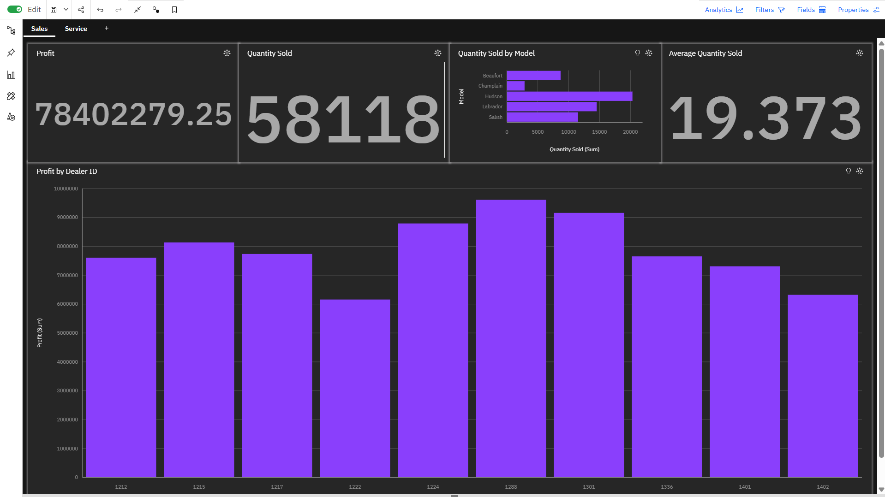
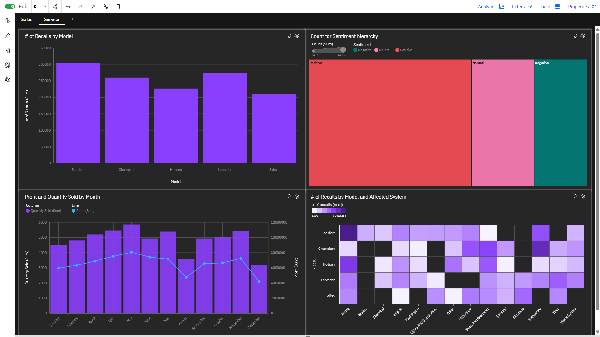

# Automotive Sales & Service Analytics Dashboard

Interactive dashboards built in **IBM Cognos Analytics**, analyzing automotive sales performance and service/recall trends across five vehicle models. Built as a hands-on project while completing IBM's *Data Visualization and Dashboards with Excel and Cognos* course on Coursera.

## Overview

This project explores two connected areas of an automotive business: **sales performance** and **service/recall activity**, using KPI cards, bar charts, line charts, and a heatmap to surface trends across dealers, models, and time.

## Dashboards

### 1. Sales Dashboard
- **Profit** and **Quantity Sold** KPI summary cards
- **Quantity Sold by Model** — horizontal bar chart comparing units sold across the Beaufort, Champlain, Hudson, Labrador, and Salish models
- **Average Quantity Sold** KPI card
- **Profit by Dealer ID** — bar chart comparing profit generated across individual dealers

### 2. Service Dashboard
- **# of Recalls by Model** — bar chart showing recall volume per vehicle model
- **Count for Sentiment Hierarchy** — treemap breaking down customer sentiment (positive, neutral, negative)
- **Profit and Quantity Sold by Month** — combo chart (bar + line) tracking monthly trends across the year
- **# of Recalls by Model and Affected System** — heatmap cross-referencing recall counts by model and vehicle system (e.g., airbag, brakes, engine, tires)

## Key Insights

- The **Hudson** model consistently ranks among the top performers in both quantity sold and recall volume, suggesting a need to monitor quality alongside strong sales.
- Recall counts are heavily concentrated across specific systems, visible at a glance through the heatmap, rather than being evenly spread across all vehicle systems.
- Profit and quantity sold trends by month reveal seasonal patterns, useful for forecasting and inventory planning.

## Tools Used

- **IBM Cognos Analytics** — dashboard building and interactive visualizations
- **Microsoft Excel** — data preparation and supporting analysis

## Skills Demonstrated

- Interactive dashboard design
- KPI reporting
- Data visualization (bar charts, line charts, treemaps, heatmaps)
- Business intelligence and data storytelling

## Certification

This project was completed as part of the **IBM-authorized Coursera course**: *Data Visualization and Dashboards with Excel and Cognos*.
Verify certificate: [coursera.org/verify/L7T8M9U3ALV2](https://coursera.org/verify/L7T8M9U3ALV2)

## Screenshots

Add your dashboard screenshots here, for example:

```markdown


```

---

**Author:** Guruvendra Singh
